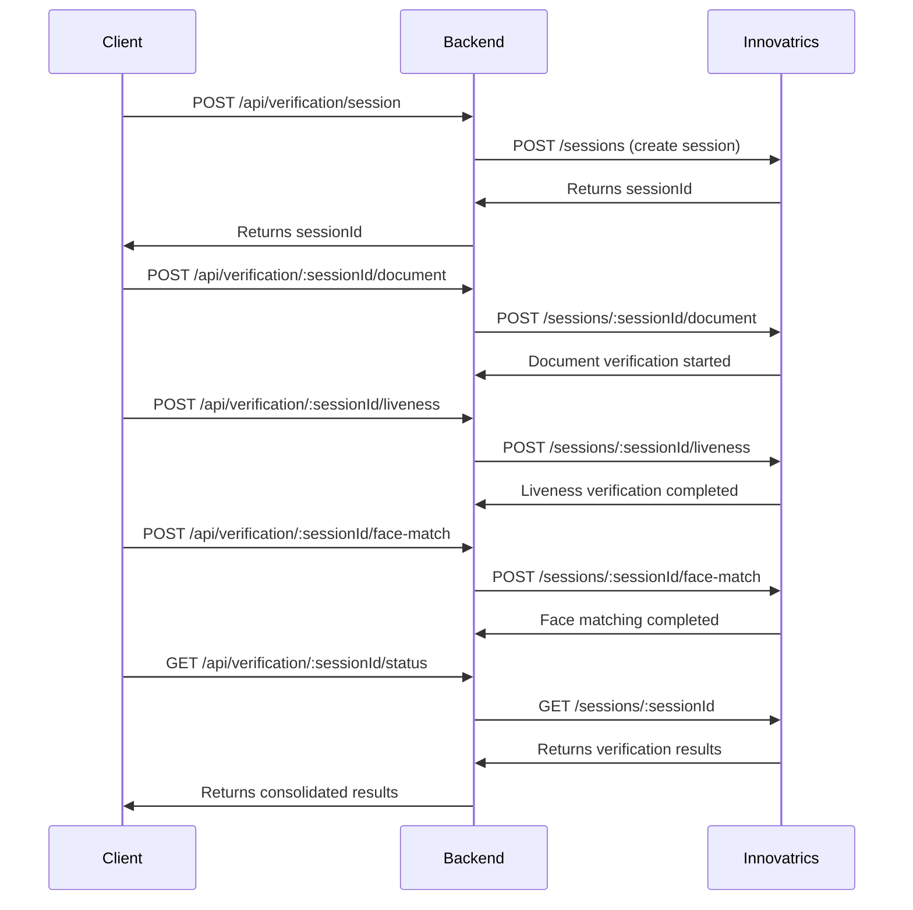

# Inspectify Backend

🚀 **Property Inspection Management Platform API** with Innovatrics DIS (Digital Identity Service) session-based verification.

## Overview

Inspectify Backend is a robust Node.js API built with TypeScript and Express, designed for property inspection management platforms. It integrates with **Innovatrics DIS** using the modern session-based flow to provide secure identity verification through document scanning, liveness detection, and face matching.

**Perfect for testing and development** - No authentication required, all endpoints are publicly accessible for easy integration testing.

## Features

- 🔐 **Session-Based Verification**: Complete verification workflow in orchestrated sessions
- 📄 **Document Processing**: ID document and passport scanning with data extraction
- 👤 **Liveness Detection**: Real-time liveness verification to prevent spoofing
- 🔍 **Face Matching**: Automated face comparison between documents and selfies
- 🛡️ **Production-Ready**: Rate limiting, CORS, security headers, and comprehensive error handling
- 📝 **TypeScript**: Full type safety and IntelliSense support
- 🔧 **Development Tools**: ESLint, Prettier, and hot reload for development
- 🚫 **No Authentication**: All endpoints are publicly accessible for testing

## Tech Stack

- **Runtime**: Node.js
- **Framework**: Express.js
- **Language**: TypeScript
- **Security**: Helmet, CORS, Rate Limiting
- **External APIs**: Innovatrics DIS (via Axios)
- **Validation**: express-validator
- **Development**: ESLint, Prettier, Nodemon

## Architecture

The API uses Innovatrics DIS session-based flow:

1. **Session Creation** - Create verification session with Innovatrics
2. **Document Upload** - Upload front/back document images
3. **Liveness Check** - Perform liveness verification with selfie
4. **Face Matching** - Compare document face with selfie
5. **Status Check** - Get comprehensive verification results

## Project Structure

```
inspectify-backend/
├── src/
│   ├── app.ts                    # Main application entry point
│   ├── config/
│   │   └── env.ts               # Environment configuration
│   ├── controllers/
│   │   └── verificationController.ts # Session-based verification logic
│   ├── routes/
│   │   └── verificationRoutes.ts    # Session-based API routes
│   ├── services/
│   │   ├── innovatricsClient.ts    # Innovatrics DIS API wrapper
│   │   └── sessionStore.ts         # In-memory session management
│   └── utils/
│       └── responseHandler.ts      # Standardized API responses
├── .env.example                    # Environment variables template
├── .eslintrc.json                 # ESLint configuration
├── .prettierrc                    # Prettier configuration
├── .gitignore                     # Git ignore patterns
├── package.json                   # Dependencies and scripts
├── tsconfig.json                  # TypeScript configuration
└── README.md                      # This file
```

## API Endpoints

### Verification Sessions

#### Session Management
- `POST /api/verification/session` - Create new verification session
- `GET /api/verification/:sessionId/status` - Get session status and results
- `DELETE /api/verification/:sessionId` - Delete/terminate session

#### Verification Steps
- `POST /api/verification/:sessionId/document` - Upload document images
- `POST /api/verification/:sessionId/liveness` - Perform liveness check
- `POST /api/verification/:sessionId/face-match` - Perform face matching

### System
- `GET /health` - Health check endpoint

## Verification Flow



## API Documentation & Testing

## API Documentation & Testing

### 📖 Interactive API Documentation

The API includes comprehensive OpenAPI 3.0 specification that can be used with external tools:

- **OpenAPI JSON**: `http://localhost:3000/api-docs.json`
- **Download for Postman/Swagger UI**: Use the JSON endpoint to import into tools

The OpenAPI specification includes:
- ✅ **Complete endpoint documentation** - All request/response schemas
- ✅ **Parameter descriptions** - What each field does
- ✅ **Example requests/responses** - Copy-paste ready examples
- ✅ **Error codes** - What responses to expect
- ✅ **Schema validation** - Understand all data structures

### 🧪 Postman Collection

A complete Postman collection is provided for easy API testing:

**Import Instructions:**
1. Open Postman
2. Click "Import" button
3. Select "Upload Files"
4. Choose `postman-collection.json` from the project root
5. The collection will be imported with all endpoints ready to test

**Collection Features:**
- ✅ **Pre-configured requests** - All endpoints with proper headers and examples
- ✅ **Variable management** - Session ID is automatically captured and reused
- ✅ **Environment variables** - Easy switching between dev/prod
- ✅ **Test scripts** - Automatic session ID extraction

### 🛠️ Testing Workflow

1. **Import the Postman collection**
2. **Set environment variable**: `baseUrl` to `http://localhost:3000`
3. **Run "Create Session"** - This will automatically set the `sessionId` variable
4. **Run "Upload Document"** - Use with base64 encoded images
5. **Run "Liveness Check"** - Use with base64 encoded selfie
6. **Run "Face Match"** - Compares document and selfie
7. **Run "Get Session Status"** - See final verification results

### 🔗 External Documentation Tools

**For Interactive Testing:**
- **Swagger Editor**: Copy the JSON from `/api-docs.json` and paste into [editor.swagger.io](https://editor.swagger.io)
- **Postman**: Import the JSON from `/api-docs.json` as an API specification
- **Insomnia**: Import the JSON for automatic request generation

### 🔄 Verification Flow


## Quick Start

### Prerequisites
- Node.js (v16 or higher)
- Yarn package manager

### Installation

1. **Clone and install dependencies:**
   ```bash
   git clone <repository-url>
   cd inspectify-backend
   yarn install
   ```

2. **Configure environment variables:**
   ```bash
   cp .env.example .env
   ```

   Edit `.env` with your actual values:
   ```env
   PORT=3000

   # Innovatrics DIS API Configuration
   INNOVATRICS_BASE_URL=https://your-dot-instance.com/api/v1
   INNOVATRICS_API_KEY=your_innovatrics_api_key
   INNOVATRICS_API_SECRET=your_innovatrics_api_secret
   ```

3. **Build the project:**
   ```bash
   yarn build
   ```

4. **Start development server:**
   ```bash
   yarn dev
   ```

5. **Access API documentation:**
   - Open `http://localhost:3000/api-docs` in your browser
   - Import `postman-collection.json` into Postman for testing

6. **For production:**
   ```bash
   yarn start
   ```

## Development Scripts

- `yarn build` - Compile TypeScript to JavaScript
- `yarn start` - Run the compiled production build
- `yarn dev` - Start development server with hot reload
- `yarn lint` - Run ESLint code analysis
- `yarn lint:fix` - Fix ESLint issues automatically
- `yarn format` - Format code with Prettier
- `yarn format:check` - Check code formatting

## Environment Variables

| Variable | Description | Required | Default |
|----------|-------------|----------|---------|
| `PORT` | Server port number | No | `3000` |
| `INNOVATRICS_BASE_URL` | Innovatrics DIS API base URL | Yes | - |
| `INNOVATRICS_API_KEY` | Innovatrics API authentication key | Yes | - |
| `INNOVATRICS_API_SECRET` | Innovatrics API secret key | Yes | - |

## API Usage Examples

### Create Verification Session
```bash
curl -X POST http://localhost:3000/api/verification/session \
  -H "Content-Type: application/json" \
  -d '{
    "userId": "user123"
  }'
```

**Response:**
```json
{
  "success": true,
  "data": {
    "sessionId": "session_abc123",
    "status": "created",
    "createdAt": "2025-10-17T14:30:00.000Z",
    "userId": "user123"
  }
}
```

### Upload Document
```bash
curl -X POST http://localhost:3000/api/verification/session_abc123/document \
  -H "Content-Type: application/json" \
  -d '{
    "frontImage": "base64-encoded-front-image",
    "backImage": "base64-encoded-back-image",
    "documentType": "passport"
  }'
```

### Perform Liveness Check
```bash
curl -X POST http://localhost:3000/api/verification/session_abc123/liveness \
  -H "Content-Type: application/json" \
  -d '{
    "image": "base64-encoded-selfie-image"
  }'
```

### Perform Face Matching
```bash
curl -X POST http://localhost:3000/api/verification/session_abc123/face-match
```

### Get Verification Status
```bash
curl -X GET http://localhost:3000/api/verification/session_abc123/status
```

**Response:**
```json
{
  "success": true,
  "data": {
    "sessionId": "session_abc123",
    "status": "completed",
    "documentResult": {
      "documentType": "passport",
      "issuingCountry": "US",
      "documentNumber": "P123456789",
      "expirationDate": "2030-12-31",
      "verificationStatus": "verified"
    },
    "livenessResult": {
      "confidence": 0.95,
      "verificationStatus": "live"
    },
    "faceMatchResult": {
      "confidence": 0.92,
      "verificationStatus": "matched"
    },
    "overallStatus": "completed"
  }
}
```

## Security Features

- **Rate Limiting**: 200 requests per 15 minutes per IP (increased for testing)
- **CORS**: Allows all origins in development for easy testing
- **Helmet**: Security headers for protection against common vulnerabilities
- **Input Validation**: Comprehensive request validation with express-validator
- **Error Handling**: Secure error responses without information leakage
- **No Authentication**: All endpoints are publicly accessible for testing

## Development Guidelines

### Code Style
- Use TypeScript for all new code
- Follow ESLint rules (run `yarn lint` to check)
- Format code with Prettier (`yarn format`)
- Use meaningful variable and function names
- Add JSDoc comments for public APIs

### Adding New Endpoints
1. Create controller in `src/controllers/`
2. Add routes in `src/routes/` with proper validation
3. Register routes in `src/app.ts`
4. Add proper error handling and validation

### Testing
Tests should be added to `**/*.test.ts` or `**/*.spec.ts` files (excluded from TypeScript compilation).

## Deployment

### Production Checklist
- [ ] Set `NODE_ENV=production`
- [ ] Configure production Innovatrics DIS credentials
- [ ] Set up reverse proxy (nginx recommended)
- [ ] Configure SSL/TLS certificates
- [ ] Set up monitoring and logging
- [ ] Configure environment-specific CORS origins
- [ ] Set up proper database for session storage (MongoDB/PostgreSQL)

### Docker Deployment
```dockerfile
FROM node:18-alpine
WORKDIR /app
COPY package*.json ./
RUN yarn install --production
COPY dist ./dist
EXPOSE 3000
CMD ["yarn", "start"]
```

## Contributing

1. Fork the repository
2. Create a feature branch (`git checkout -b feature/amazing-feature`)
3. Make your changes
4. Run tests and linting (`yarn lint && yarn format:check`)
5. Commit your changes (`git commit -m 'Add amazing feature'`)
6. Push to the branch (`git push origin feature/amazing-feature`)
7. Open a Pull Request

## License

This project is licensed under the MIT License - see the [LICENSE](LICENSE) file for details.

## Support

For support and questions:
- 📧 Email: support@inspectify.com
- 📞 Phone: +1 (555) 123-4567
- 📚 Documentation: [docs.inspectify.com](https://docs.inspectify.com)

---

**Built with ❤️ for secure property inspection workflows using Innovatrics DIS**
